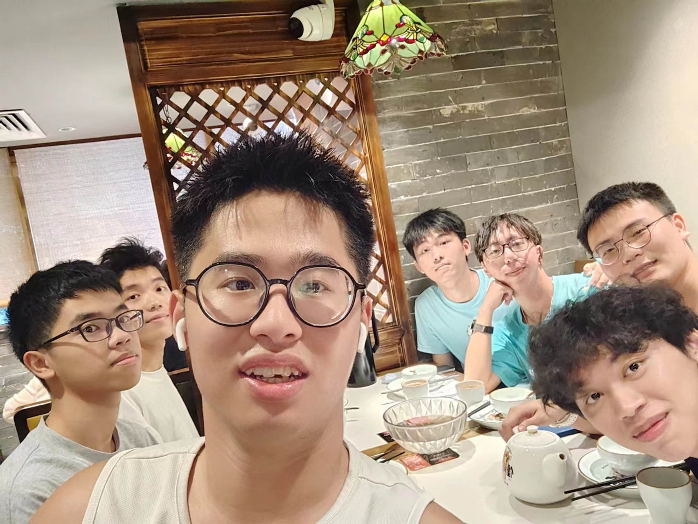

## With Friends

My friend, Watermelon formed a WeChat group to contact each other who were classmates in middle school and who are studying in Guangzhou Higher Education Mega Center now. There are total 10 members in the group. I don't remember when it started, we made a date that whoever is not available should give a dinner party to others.

Watermelon has been the second one who treated to our dinner. Actually, we split the cost of meal. While we were glad to do that and enjoyed the mutual moments.

We didn't have dinner for his relationship so much as[^1] our togetherness. I am convinced that we are going to be farther and farther apart. Every single one would have or have already had his own goal(s) and course of life. Before arriving at the restaurant, we'd like to center gossip around his love story, while we talked about current employment situation and our future plan more.

[^1]: [not so much sth as sth](https://dictionary.cambridge.org/zhs/%E8%AF%8D%E5%85%B8/%E8%8B%B1%E8%AF%AD-%E6%B1%89%E8%AF%AD-%E7%AE%80%E4%BD%93/not-so-much-sth-as-sth)

I don't like to share my daily life in WeChat Moments. Luckily, I can record anything here and share with anyone I want.

Cherish such a moment, just like every sunset around GaoKao Building in Suixi. It seems that memories of the past are always less troubling than the present, and carry with them the romance of fragmentary uncertainty.

## When to say goodbye?

She told me we would all cuddle up loneliness in the end in Naozhou Island. We would find that in university. Just like......you know, getting away from your friends? It is not subjective. You will encounter it, just as you will find yourself following a set track controlled by social clock.

I predict that it would be a long, long time before we met again. At least, we're not all together anymore. There were supposed to be 10 members there today, but in the end, only 7 members showed up. One should participate in LOL gaming tournament, one is far away in Dongguang and inconvenient to come over, and one needs to take a lab class.

It occurs to me that what I said as a kid to my 3 friends who palyed with me from first grade to sixth grade. Nevertheless, we don't have connection for several years.

The situation might change because of our ages. We all reached maturity, and have selected different types of life. Someone would left us, and someone would appear in the meanwhile.

Who I would say goodbye to him/her? Who would accompany me a long, even lifelong journey?
