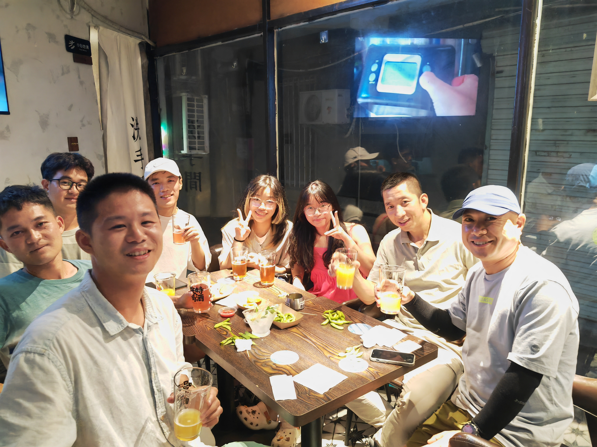

---

It is a night of unparalleled enchantment.

It must be a fate or a density. I was trapped in guilt over Fantuan. I always think I couldn't give back the gift to her and cost her enthusiasm and kindness in the meanwhile.

In the Tencent Meeting, she introduced some people in Xibu village. She didn't mention me tonight, which let me feel down, pity and depress. I don't blame to her, on the contray, it's my deal.

Walking with Maofu on the stree in Xiamen Island, and we shared feeling toward Heishiyu with each other, which can reduce a few depression. Much to my relief, I can meet Maofu, Xiaozhuang and Xiaoyang here. I like them sincerely--a feeling of deep and faithful attachment. Heishiyu has given me more gifts than I can return: about them, about the specific memories belong to us.

Xiaojian, Maofu's senior, invited Maofu to have late-night supper, I accompanyed him. On the way to the bar, We had a photo.

To our surprise, Xinyi, Xinyu and two other strange participates were all in the bar.

It's a bar featuring Jay's music. Every drink we had was named after a sole Jay Chou's song. I ordered 「Lovely woman」.

This side of the bar's space which we were within undergoed a dynamic transformation between the public and private spheres. I was enchanted to talk with Xinyi and Xinyu this moment--Learning something about each other hidden in routine life. In other words, little by little, we were opening up to each other.

What an amazing night, far away from school, far away from nervous about future, there is no stress, no troubleless, only teenagers' curiosity toward life itself.
