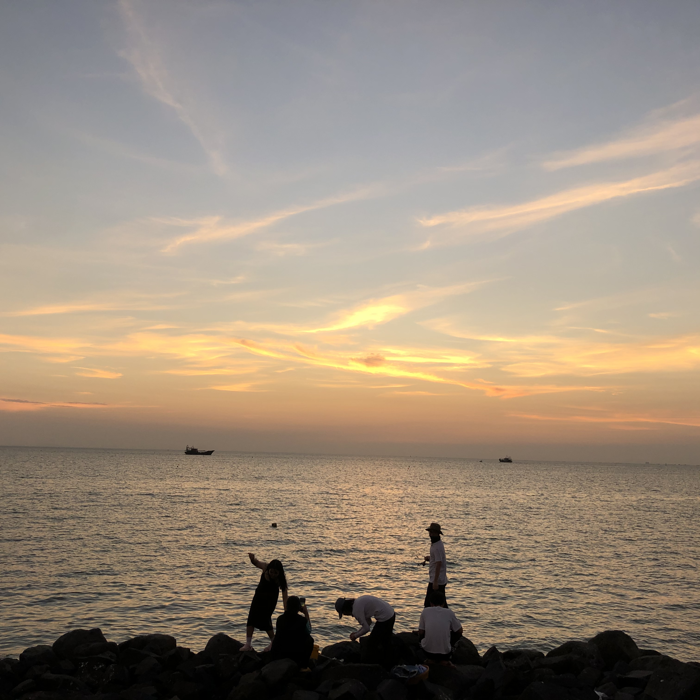
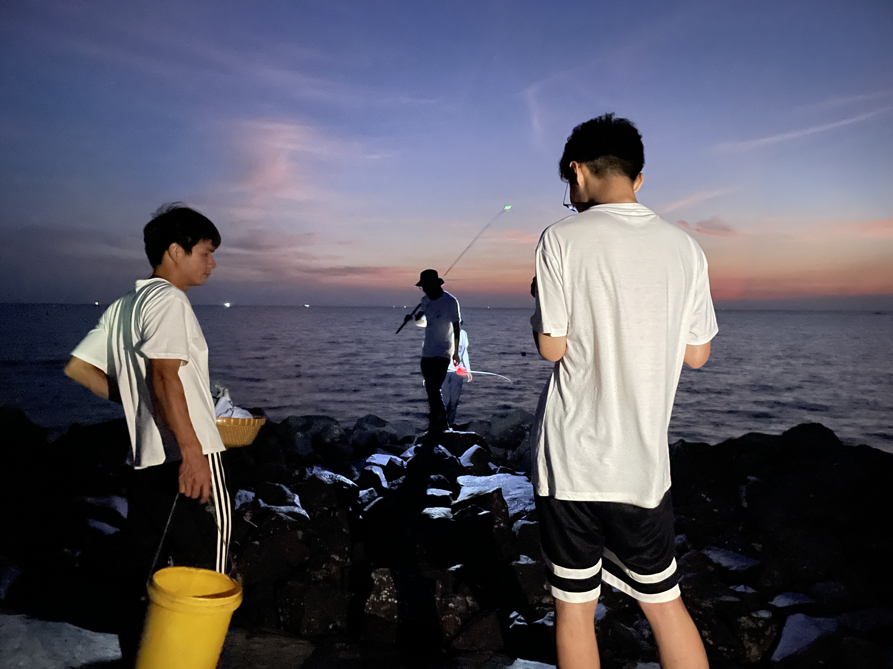

---

<iframe frameborder="no" border="0" marginwidth="0" marginheight="0" width="330" height="86" src="//music.163.com/outchain/player?type=2&amp;id=1982681570&amp;auto=1&amp;height=66"></iframe>

I make friends with a new friend called Caixin who was mentioned by Fantuan early. This is the first time I met her, a lovely, active and easy-going girl. My teacher, Mr Wang also mentioned her in a commentary in Douban with admiring tone.

HeiShiYu, a magical place which could gather sincere and friendly person. I have met a lot of people who made me feel connected to others here. Caixin, One of them would be recorded with the moments between her and me. I will share memorizes about other friends later.

## Sunset

I came back HeiShiYu. Zhuang told us sunset clouds would be incredibly beautiful. We could trace it while we are fishing.

But I am attracted by this one, which was photoed by Caixin.

## Talking

Caixin will leave for Foshan tomorrow. My first reaction is upset, just as my first reaction when I arrived at Heishiyu today and heard she had stayed here was one of happiness.

There's no Milky Way on the rooftop in Heishiyu tonight, just a handful of stars.

Like my old friends I've known in the past, Caixin talked with me on the rooftop. We talked about work, study and perception of ourselves. She was willing to listen to me.

I always worry about whether I would be chattering or noisy------I have many words to say and countless ideas to convey. To my surprise, Caixin said she liked to listen to me. Which built up my courage in passion for expression.

I can feel it, her sincerity. She isn't that girl who does well in embellishing words, while her approach to life is vibrant, her ego is in the midst of life, which are all infecting me.

I love everyone who made friends with and stayed up late with me.
