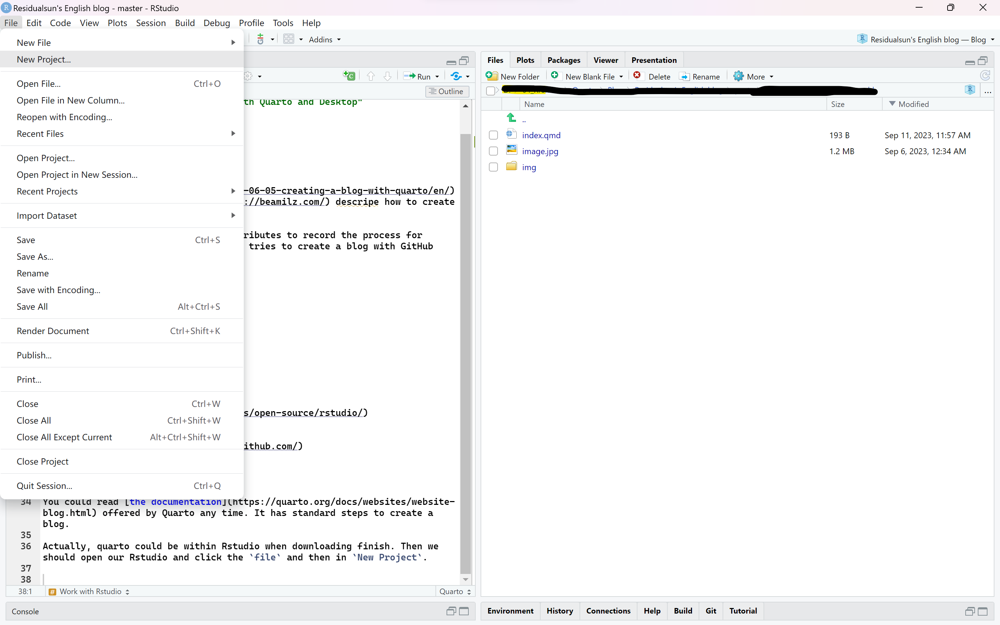
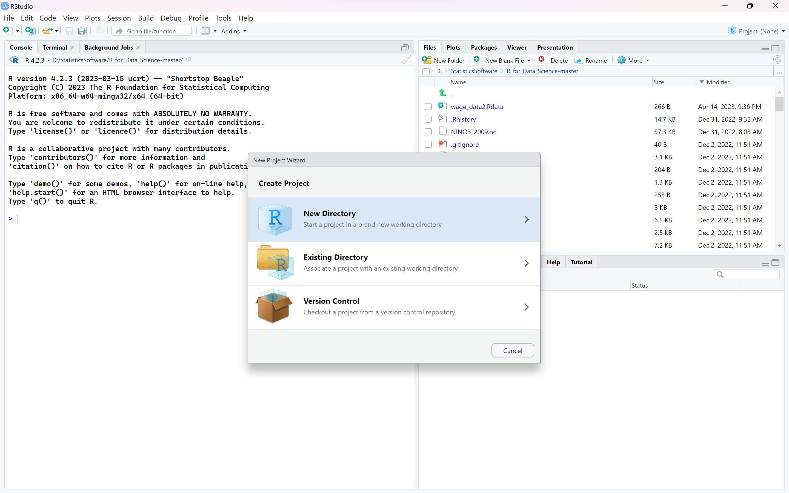
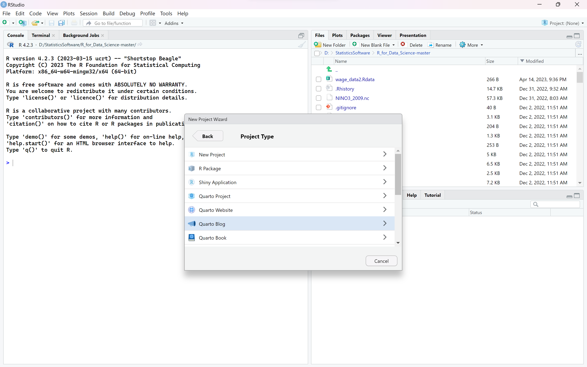
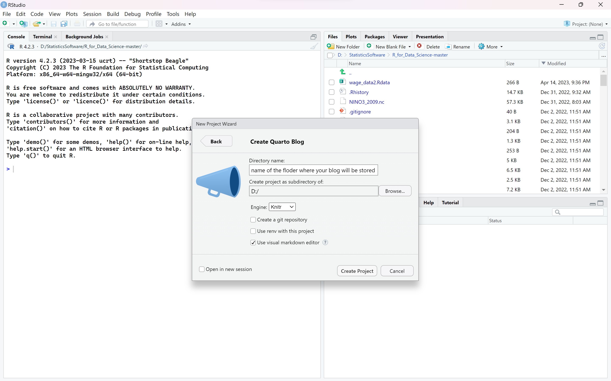
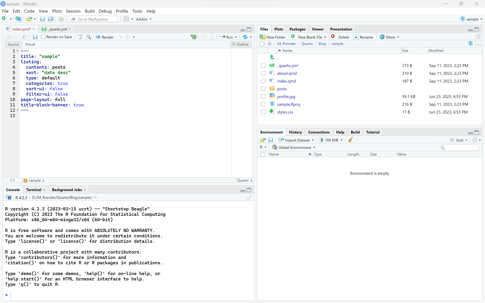
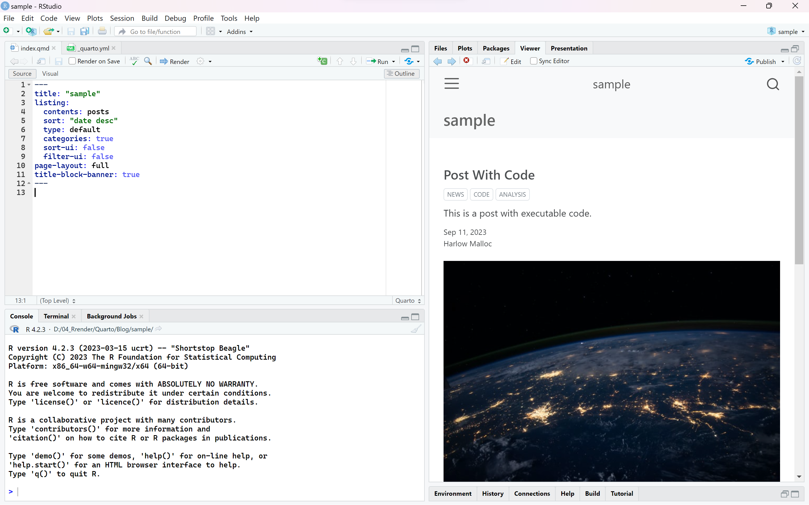
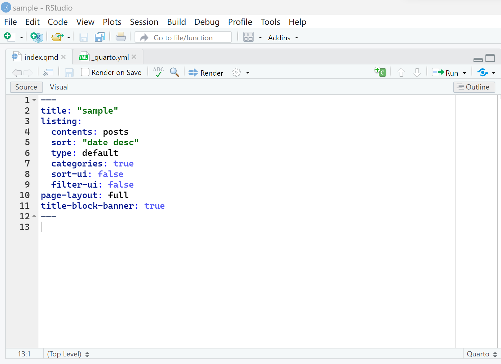
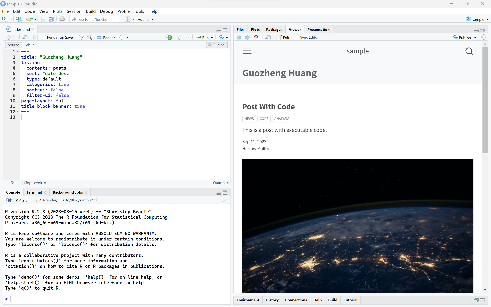

Ahead of my blog, there has been a [blog](https://beamilz.com/posts/2022-06-05-creating-a-blog-with-quarto/en/) which was written by [Bea Milz](https://beamilz.com/) descripe how to create a blog belong to someone.

This blog was inspired by it and contributes to record the learning process for myself. May it would help someone who tries to create a blog with GitHub Desktop rather than Git.

Let's begin!

# 1.Prerequisites

## Install

You should have all of the softwares blew.

::: {.callout-note icon="false"}
## Important

1.  [R](https://www.r-project.org/)
2.  [Rstudio](https://posit.co/products/open-source/rstudio/)
3.  [Quarto](https://quarto.org/)
4.  [Git](https://git-scm.com/)
5.  [GitHub Desktop](https://desktop.github.com/)
:::

And you should have a GitHub account and I assume you could get the basic hang of it.

# 2.Work with Rstudio

You could read [the documentation](https://quarto.org/docs/websites/website-blog.html) offered by Quarto any time. It has standard steps to create a blog.

## 2.1.Create

Actually, quarto could be within Rstudio when downloading finish. Then we should open our Rstudio and click the `file` and then in `New Project`.

{fig-align="center" width="80%"}

Choose `New directory`.

{fig-align="center" width="80%"}

Scroll down until you find `Quarto Blog`

{fig-align="center" width="80%"}

Click it and then you would see such an interface.

{fig-align="center" width="80%"}

::: callout-note
`Directory name` means place where you want floder of blog to be stored.`Create project as subdirectory of` means place where you want all of the floders concerning blog to be saved. Generally, I save it in D drive.
:::

This is a demo.

{fig-align="center" width="80%"}

`index.pmd` and `_quarto.yaml` are crucial files.They control arrangement and appearance of your blog. We will discuss it in details later.

## 2.2.Preview

Stay in this interface and click `Render` in `index.qmd` file, you would preview your own blog in right window.

{fig-align="center" width="80%"}

At this point, you have basically created a simple blog.

# 3.Modified blog

Rather than creating a GitHub account(as what I have said formly), I would like to modify and decorate the blog firstly. What attracts me most in this process is exploring the funtion of `index.qmd` and `_quarto.yaml` file.

::: callout-note
Cause I still explore how to use Quarto, this section may contain something wrong and would be sometimes updated.

Welcome to point out my fault and problem in comments;-).
:::

## 3.1.「index.qmd」

{fig-align="center" width="80%"}

OK, let's look at this interface.I will introduce default setting and then supply something necessary.

In Quarto blog, `index.qmd` would be always used. We can divide it into two uses. One is set for your blog homepage, the other is set for your single article.

### 3.1.1.For homepage

`title` determine your homepage name. `listing` includes a series of settings for your decoration in homepage.

I change the title into my name, and it presents as blew.

{fig-align="center" width="80%"}

### 3.1.2.For single article

Quarto needs a lot of 「index.qmd」 file, it is really different from `blogdown`. When you want to write a article, it is necessary to add a new 「index.qmd」file. For convenience,  

## 3.2.「\_quarto.yaml」
