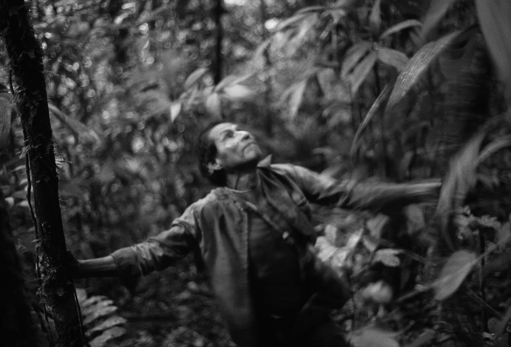

> "According to pepole in Avila, dreams are the product ot the ambulations of the soul. During sleep, the soul separates from the body, its 'owner', and interacts with the souls of other beings. Dreams are not commentaries to the world; they take palce in it (see also Tedlock 1992)
>
> The vast majority of dreams that are discussed in Avila are about hunting or other forest encounters. Most are interpreted metaphorically and establish a correspondence between domestic and forest realms. For example, if a hunter dreams of killing a domestic pig he will kill a peccary in the forest the following day. The nocturnal encounter is one between two souls--that of the pig and that of the Runa hunter. 