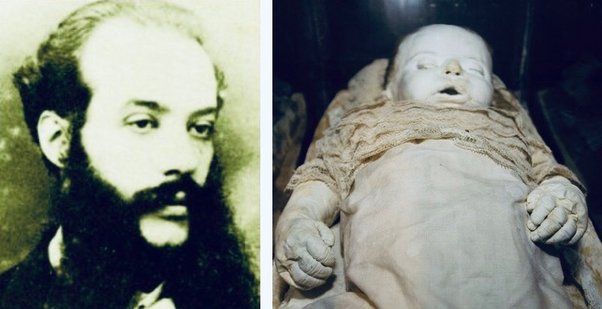
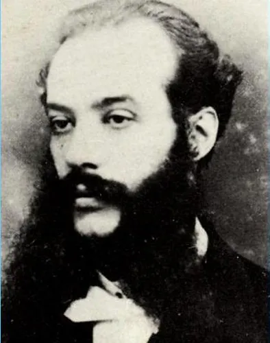

::: callout-tip
Today word: **corpse**, **formula**, *Petrifier*, *reversibility*, **tissues**, **deceased**, **elastic**, **petrified**, **medallion**, **macabre**, **furnishings**, **scorn**, **sinister**
:::

A post concerning "Which scientist never revealed the secret of his discovery?" in Quora attracted my attention tonight. A user named Davide Fiore answered the question with Efisio Marini, an Italian scientist who got the hang of a method to preserve corpses through petrifing and restoring it.

{fig-align="center"}

Efisio Marini(1835-1900) was born in a wealthy family and graduated in medicine and natural sciences. He was employed as an assistant at the natrual histroy museum. That was not his ideal jod, while allowed him to immerse himself in palaeontology research.

{fig-align="center"}

Marini believed fossil was the most perfect state, which means *"la vittoria contro la degradazione e la conquista dell’eternità"*[^English] And was dying to turn the fossil into what it was at the beginning.

[^English]: Overcoming degradation and conquering eternity.

https://qr.ae/pKlZgY

https://percorsidisardegna.wordpress.com/2011/02/16/efisio-marini-il-pietrificatore-2/
