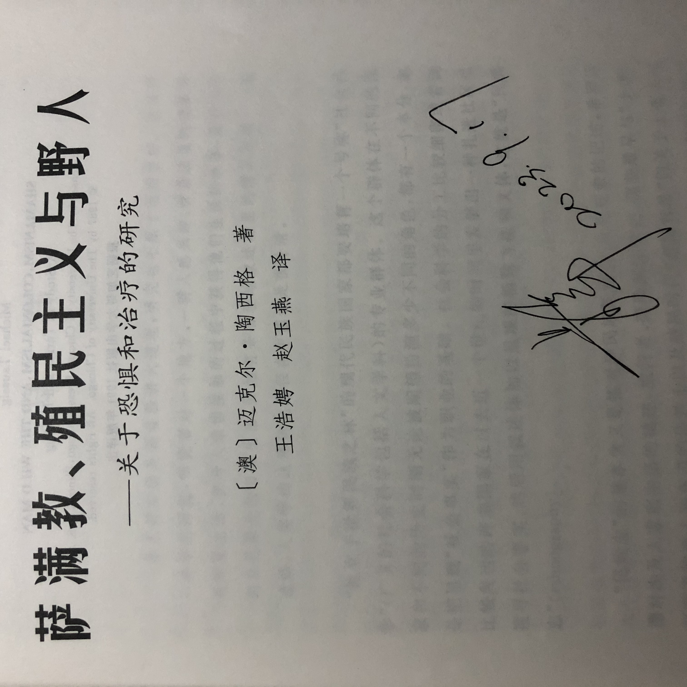

Secure in the knowledge that my parents have been respecting for and supporting my **pursuit**.

I went to Fudan University to participate in a lecture on medical anthropology with two classmates by train on 17th September, 2023.

What surprised my friends and teachers was our willingness to travel to Shanghai despite what seemed like such a short and rushed period of time from Friday to Monday.

Some people would like to regard our action as 「*Special Forces Travel*」. While from my own point of view, I am willing to trace any chance and possibility about growth.

This was the first time I had seen Guanghua Tower. I have seen it some times in bilibili. It still attracted me——It's a symbolism, which means a better future……

It's my honor to be photographed with Professor Jun Jing from Tsinghua University.

It's a pity that I failed to have a single photo with him. Nevertheless, the sign from him enable to offset the disappointment^^.

{fig-align="center" height="80%" width="80%"}

I knew Southern theory which could be called Sociology Theory of absence from Jun Jing. When Prof.Jing asked us to write down five sociology theories, I can only recall theories from Marx、Weber、Durkheim、Parsons and Goffman. What they all have in common is that they come from European and American societies.

Pro.Jing pointed out that we were trapped in Euromaidan mainstream theory. He named it as 「*The Prisoner's Mind*」. Jun Jing wanted to writed down 100 Southern sociologists' history and he has finished at least 20 stories with some students. One of  the undergraduates he taught read more than a dozen original books in order to write the entire life of a Pakistani sociologist. It sounds amazing. There is no denying that we should get the hang of some classic theory such as Marx、Durkheim and Weber's theory, but it shouldn't be the cause not to learn about Southern Theory.
