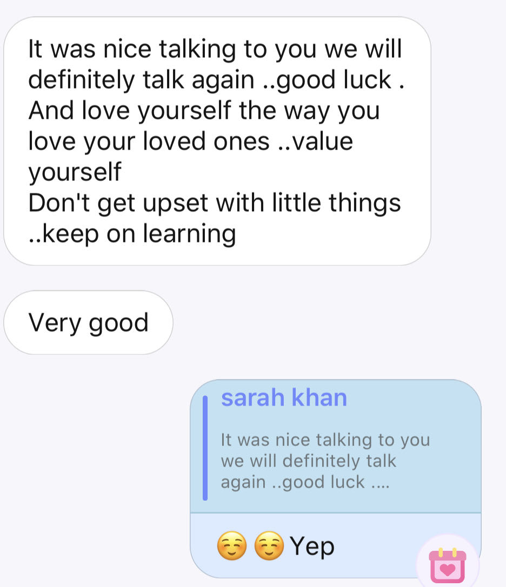

What a magical afternoon it was!

Actually, I felt upset today. I don't konw the conceret reason, and I can only blame it to my ambiguous thinking. For example, too much homework took invasion of me, I suddenly reflect on my future. What should I do after one year? In other words, the core of the falldown feeling is my absence of self-knowledge toward my own question and problem.

I came back to HelloTalk and entered a voice room, and had found a boy called Akon playing guitar and singing. I was arracted by it. But the network had something wrong. I opened a new voiceroom and invited him to join. To my surprise, a girl who comes from Pakistan also came in. Her voice is soft, friendly and kind.

Her name is Sarah.

I suggested Akon to play guitar again. Haha, his first reaction seemed to be a bit coy and uncertain. I record half of the performance.

<audio src="Akon.mp3" preload="none" controls loop>

</audio>

The song he played was a little deeply felt but not mawkish. It seemed that there was a story behind it. You know...just like a scene from movie. A group of people sat around a campfire. A young guy held his guitar and then played it. When the song finished, he would tell us there was a girl waiting for him in the distance. And all the longing miss were conveyed to us through the melody. That was my imagination, but it was charming and enchanting, all right?

It comforted me that time. In the fact, music can connect performance and his/her audience. In the point of my view, sometimes the role of music is equal to story. They could both bond strangers, and that's why I told Sarah I refreshed, I felt better.

Sarah is so patient that she could listened to my eternal talking. She asked my why I was upset today and pointed out I overthought. What impressed me most was her patience and words referred to *"don't overthink"* and *"value yourself"*.

And she is a postgraduate student who majors in anthropology! I couldn't contain my overwhelming excitement due to I am interested in it and there was a time when I explored my academic possibility in that discipline.

> "It is only when it comes time to apply knowledge that you regret not acquiring enough of it"[^cite]

[^cite]: [WiKi](https://en.wiktionary.org/wiki/%E4%B9%A6%E5%88%B0%E7%94%A8%E6%97%B6%E6%96%B9%E6%81%A8%E5%B0%91#:~:text=For%20pronunciation%20and%20definitions%20of,enough%20of%20it.%E2%80%9D).), it could be translated in Chinese as "书到用时方恨少"。

Oh god, my poor English vocabulary deadly limited my communication with Sarah concerning anthropology. I even had to prove to Sarah that I am studying anthropology through the name "Malinowski". Nevertheless, I have also read some books written by other famous anthropologist such as Marcel Mauss, Michael Taussig, Edward Evan Evans-Pritchard and Edmund Ronald Leach. I can't believe I couldn't express my reasearch core of filed work to Sarah. So... what have I done when I was in Naozhou Island? What I can tell was that I have stayed in there for 47 days and always organized fishing nets with fisherman.

As what I said before, Sarah was patient. She was willing to wait for me to convey my thoughts through typing it on the screen. And she shared her bachelor degree thesis work with me!

Her thesis is "Group solidarity and endogamous marriages: a study of intra-caste dynamics."